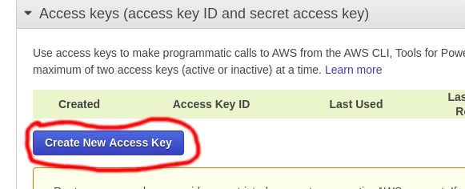

# ocx


[](https://goreportcard.com/report/github.com/thiago-scherrer/ocx)

Outro CLI x

## Como instalar

Usando go get (go >=1.14.4):

```sh
$ go get github.com/thiago-scherrer/ocx
$ $GOPATH/bin/ocx --help

Another cli X

Usage:
  ocx [command]

...

```

## Como usar

Vá até o [security credentials](https://console.aws.amazon.com/iam/home#security_credential) do seu/sua usuário/a e gere as chaves de acesso:



Com os dados gerados execute o setup, com o comando `ocx setup`:

```sh
$ ocx setup
Enter the AWS_ACCESS_KEY_ID: aaaaa
Enter the AWS_SECRET_ACCESS_KEY: bbbbb
Enter the AWS region: us-east-1

```

O AWS region é onde você está executando a infra instrutura.
Você pode pegar este dado no canto superior de sua conta.

Listando Log Groups:

```sh
$ ocx log group

ola42
```

Listando Streams:

```sh
$ ocx log stream --gname ola42 --sec 1000000ola42

logstream
```

Recebendo os eventos de logs:

```sh
$ ocx log tail --gname ola42 --sname logstream --lines 10

2020/06/08 01:48:57 Event messages for stream logstream in log group ola42:
teste1
teste2
teste3
teste4
teste5
teste6
teste7
teste8
teste9
teste10

```
